<link href="css/style.css" rel="stylesheet"/>
<link href="css/tweet.css" rel="stylesheet"/>

# Blockchain et cryptomonnaies

 
 
 

Thibault Ayanides

---

## Sommaire

<!-- .slide: class="align-left big-slide" -->

### 1. La blockchain

#### 1.1 Blocs, fonctions de hachage, signature

#### 1.2 Arbre de merkle et anatomie des blocs

### 2. Le Bitcoin

#### 2.1 Cryptomonnaies

#### 2.2 Les wallets

#### 2.3 Décentralisation

#### 2.4 Cheminement d'une transaction

#### 2.5 Minage

#### 2.6 Dimensionnement du Bitcoin

---

## Sommaire

<!-- .slide: class="align-left big-slide" -->

#### 2.7 Anonymat

#### 2.8 Critiques

#### 2.9 Limitations du Bitcoin

### 3. Les Altcoins

#### 3.1 Ethereum

#### 3.2 Smart Contracts

#### 3.3 Defi

#### 3.4 NFT

#### 3.5 Stablecoins

#### 3.6 Layer 1 et Layer 2

### 4. Investissements ?

---

# 1. La blockchain

---

## Blockchain

- Technologie de transmission et de stockage d'information
- Base de données distribuée ou non
- Registre d'enregistrement
- Incorpore des mécanismes de sécurisation et de protection contre la falsification fondées sur la cryptographie
- Permet l'utilisation de cryptomonnaies
- ⚠️ On peut utiliser des technologies blockchains sans cryptomonnaies : Hyperledger

<!-- .slide: data-background="./img/blockchain.png" data-background-opacity="0.2" -->

---

## Vous avez dit blocs ?
<!-- .slide: class="big-slide" -->

- Composées de plusieurs blocs
- Chaque bloc contient un certain nombre d'enregistrement (transactions, documents, ...)

<!-- .element: class="fragment" -->

# Mais d'abord un point de cryptographie !

---

## Les fonctions de hachage

On appelle <em>h</em>, fonction de hachage si elle répond aux caractéristiques suivantes :

<ul>
  <li> <em>h(m)</em> se calcule facilement</li> <!-- .element: class="fragment" -->
  <li> pour une valeur <em>d</em> donnée, il est très difficile de trouver <em>m</em> tel que <em>h(m)=d</em> </li> <!-- .element: class="fragment" -->
  <li> on ne peut modifier un message m sans changer son hash </li> <!-- .element: class="fragment" -->
  <li> étant donné <em>m1</em>, il est très difficile de trouver <em>m2</em> tel que <em>h(m1)= h(m2)</em></li> <!-- .element: class="fragment" -->
</ul>

  
<!-- .element: class="fragment" -->
    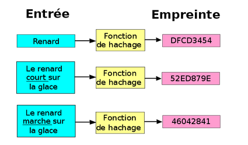
  

  
<!-- .element: class="fragment" -->
    
Exemples :

    <ul>
      <li>MD5</li>
      <li>SHA-1</li>
      <li>SHA-2</li>
  

---

## Les signatures électroniques

<!-- .slide: class="big-slide" -->

---

## Caractéristiques d'une signature numérique

- Identification du propriétaire de la signature
- Garantie de la non altération du document entre la signature et la lecture
  - authentique
  - infalsifiable
  - non réutilisable
  - inaltérable
  - irrévocable

---

## Arbre de Merkle

<!-- .slide: class="big-slide" -->

---

## Intérêt des arbres de Merkle

<!-- .slide: class="big-slide" -->

Permet de vérifier un enregistrement sans tout télécharger.
Sans ça chaque utilisateur de la blockchain devrait la stocker en local !

---

## Anatomie d'un bloc

<!-- .slide: class="big-slide" -->

---

## Anatomie de la blockchain

---

# 2. Le Bitcoin

---

## Cryptomonnaies

- Cryptoactifs, cryptodevises, monnaies numériques, ... (nom sujet à débat)
- Émise de pair à pair sans passer par une banque centrale
- Souvent décentralisée
- Repose sur la cryptographie pour sécuriser les transactions

 
 

Plusieurs objectifs initiaux :

 
 

  

    
    se passer de tiers de confiance
  

  

    
    être rapide et fiable
  

  

    
    éviter l'hyperinflation
  

---

## Bitcoin

Une cryptomonnaie parmi beaucoup d'autres !

  

    <ul>
      <li>Une cryptomonnaie</li><!-- .element: class="fragment" -->
      <li>Un protocole</li><!-- .element: class="fragment" -->
      <li>Une blockchain</li><!-- .element: class="fragment" -->
    </ul>
  

  

    
  

---

## La naissance du Bitcoin

  

    <ul>
      <li>v1.0 sort en 2009</li>
      <li>Créé par Satoshi Nakamoto</li>
      <li>Première cryptomonnaie</li>
      <li>Limité à 21 millions de coins</li>
      <li>Minable par preuve de travail (PoW)</li>
    </ul>
  

  

    
  

---

## Une transaction Bitcoin

<!-- .slide: class="big-slide" -->

---

## Les wallets

<ul>
  <li>Une identité</li>
  <li>Une clé publique et une clé privée</li>
  <li>Logiciel permettant de gérer sa cryptomonnaie</li>
  <li>Hardware wallet vs Software wallet</li>
</ul>

 

Exemples:

  

    
  

  

    
  

  

    
  

  

    
  

  

    
  

  

    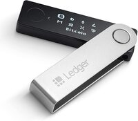
  

---

## Hot wallet vs Cold Wallet

  

    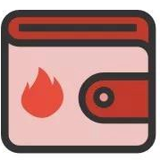

  

  

    

  

  

    <ul>
      <li>Fonds accessibles rapidement</li>
      <li>Connecté à Internet</li>
      <li>Vulnérable au phishing</li>
      <li>Vulnérable à la réglementation</li>
    </ul>
  

  

    <ul>
      <li>Fonds moins accessibles</li>
      <li>Pas connecté à Internet</li>
      <li>Plus sécurisé</li>
      <li>Invulnérable à la réglementation</li>
    </ul>
  

---

## Une transaction Bitcoin

<!-- .slide: class="big-slide" -->

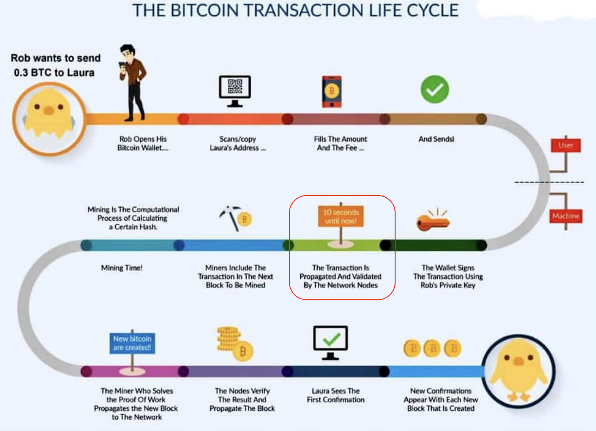

---

## Modèle centralisé vs modèle décentralisé

<!-- .slide: class="big-slide" -->

  

    
    <ul>
      <li>Pas de confiance entre les pairs</li>
      <li>Confiance en un tiers</li>
      <li>Point de défaillance</li>
    </ul>
  

  

    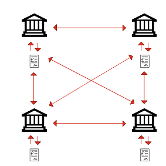
    <ul>
      <li>Pas de confiance entre les pairs</li>
      <li>Pas de dépendance en un tiers</li>
      <li>Pas de point de défaillance</li>
      <li>Difficulté d'évolution du protocole</li>
    </ul>
  

---

## Validation d'une transaction

- Vérification de la syntaxe
- Vérification de la taille de la transaction ( < 1MB et > 100B)
- Vérification que input >= output
- Vérification que l’input n’est pas trop petit
- Vérification que les clefs publiques input possèdent bel et bien le bitcoin en question
- Parcours de l’entièreté de la blockchain pour retrouver le bitcoin en question et vérifier s’il appartient bien à la même clef
- La possession des bitcoins se fait à travers l’historique des transactions !

---

## Une transaction Bitcoin

<!-- .slide: class="big-slide" -->

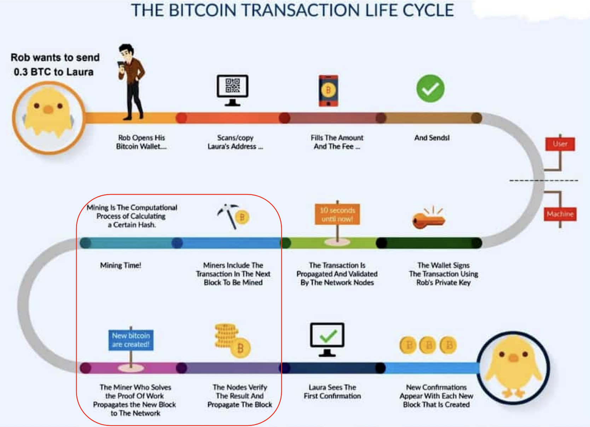

---

## Le minage

  

    <ul>
      <li>Création d'un bloc à partir des transactions en attente</li>
      <li>Résolution du problème dit de <em>Proof of work</em></li>
      <li>Le premier mineur résolvant le problème l'annonce sur le réseau</li>
      <li>Il créé une transaction spéciale qui le crédite d'un certain nombre de Bitcoin</li>
      <li>Les autres blocs vérifient que le problème est bien résolu</li>
    </ul>
  

  

    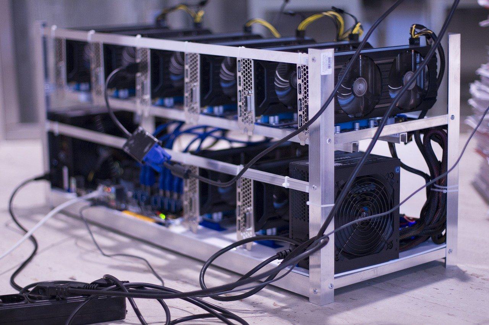
  

---

## Le proof of work

  

    
  

  

    <ul>
      <li>Résoudre un problème de force brute</li>
      <li>Trouver un hash tq <em>h(h(header)) < d</em></li>
      <ul>
        <li><em>h</em> est la fonction de hachage</li>
        <li><em>nonce</em> est un entier sur 4 octet que le mineur peut faire varier</li>
        <li><em>d</em> est la difficulté du minage</li>
      </ul>
    </ul>
  

---

## Un hardware très spécialisé

<!-- .slide: class="big-slide" -->

  

    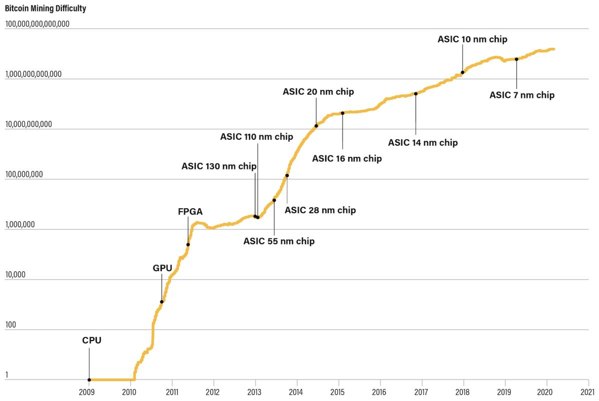
  

  

    <ul>
      <li>GPU</li>
      <ul>
        <li>permet de paralléliser beaucoup plus les calculs qu'un CPU</li>
      </ul>
      <li>FPGA</li>
      <ul>
        <li>reprogrammable</li>
        <li>plus efficace énergétiquement</li>
        <li>très abordable, utilisé pour le prototypage rapide</li>
      </ul>
      <li>ASIC</li>
      <ul>
        <li>non reprogrammable</li>
        <li>encore plus efficace énergétiquement</li>
        <li>très cher</li>
      </ul>
    </ul>
  

---

## Une transaction Bitcoin

<!-- .slide: class="big-slide" -->

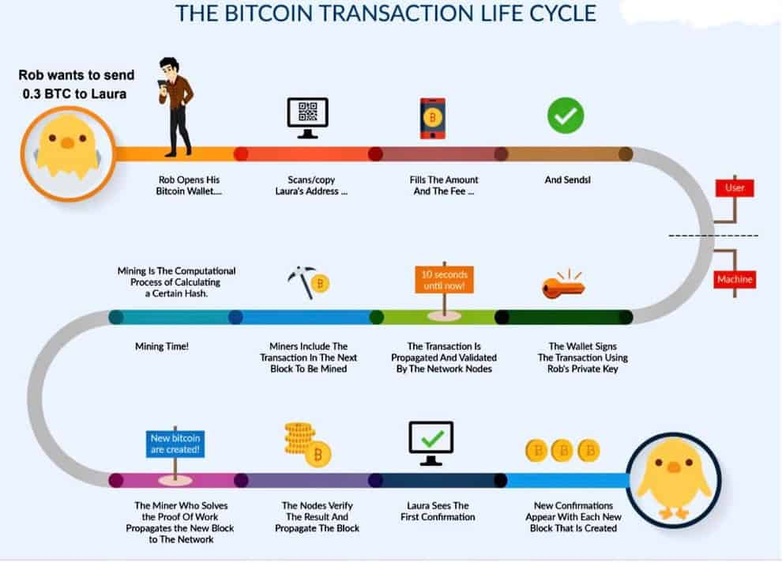

---

# Pourquoi ce mécanisme sécurise-t-il la blockchain ?

---

## Quelques datas sur le Bitcoin

- La fonction de hachage utilisée est _sha256_
- Actuellement la récompense est de 6.25 BTC par bloc miné (divisé par 2 tous les 4 ans)
- 21 millions de Bitcoin maximum
- 1 bloc contient entre 1000 et 2000 transactions (limité par un taille max de bloc de 1Mo)
- 1 bloc toutes les 10 minutes
- Donc 1 moyenne de 7 transations par seconde
- Difficulté ajustée tous les 2016 blocs(2 semaines environ)
- La blockchain pèse 370 Go (2021), la taille augmente de 1Go tous les 2 mois
- https://www.blockchain.com/explorer

---

## Mécanismes de consensus

Que se passe-t-il si les blocs n'arrivent pas dans le bonne ordre et que la blockchain se "désynchronise" ?

- Le protocole impose de ne conserver que la chaîne qui a demandé le plus de travail
  - celle ci devient la chaine principale
  - les autres sont des _forks_
- On attend un certain nombre de confirmations (généralement 6) pour considérer que la transaction a bien été ajoutée à la chaîne principale

 

**Les mécanismes de consensus sont un élément capital pour assurer d'une homogénéité de chaque copié de la blockchain détenue par les nœuds !**

---

## Une transaction Bitcoin

<!-- .slide: class="big-slide" -->

---

## L'attaque des 51%

- Attaque de double dépense : réécriture de la blockchain
- Principale vulnérabilité du consensus Proof of Work
- Au vu de la puissance de hashage actuelle, un telle attaque coûterait 10 milliards en matériel et environ 5 millions par heure
- Déjà arrivée sur certaines cryptomonnaies (ETC, BTG)
- Objectifs : casser la confiance, réécrire l'historique

---

## Le bitcoin et l'anonymat

**Le Bitcoin ne permet pas l'anonymat !**

  

    <ul>
      <li>Adresses IP traçables
      <li>KYC sur les sites permettant d'acheter du BTC
      <li>Anonymat des adresses mais tout au plus pseudonymat des utilisateurs
      <li>Exemple de Silkroad
    </ul>
  

  

    
  

L'historique de toutes les transactions est dans la blockchain !

---

## Avantages et limites du protocle Bitcoin

  

    <h3>Avantages</h3>
    <ul>
      <li>Décentralisation</li>
      <li>Traçabilité</li>
      <li>Réapproptiation de la valeur monétaire</li>
      <li>Rapidité (par rapport à un virement)</li>
    </ul>
  

  

    <h3>Inconvénients</h3>
    <ul>
      <li>Scalabilité</li>
      <li>Consommation énergétique du PoW</li>
      <li>Rapidité (par rapport à un paiement VISA)</li>
    </ul>
  

---

# Critiques

---

## Le Bitcoin est une pyramide de Ponzi

  

    <h3>Pyramide de Ponzi</h3>
    <ul>
      <li>Rémunération des anciens clients par les nouveaux </li>
      <li>Promesse de rendement élevé sans risque</li>
      <li><b>Caractéristiques</b> : recrutement, secret, payement à l'entrée</li>
      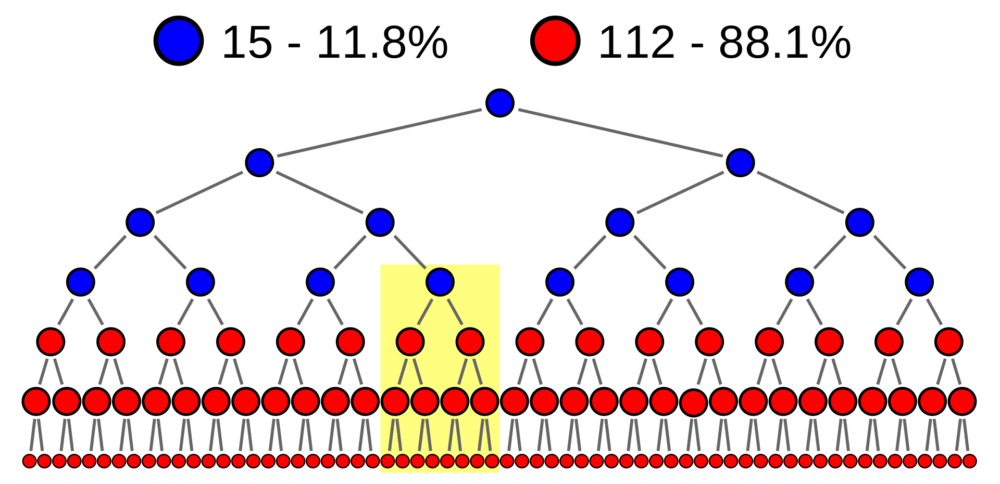
    </ul>
  

  
<!-- .element: class="fragment" -->
    <h3>Et le Bitcoin, alors ?</h3>
    <ul>
      <li>Communautés <em>to ze moon</em> et <em>have fun staying poor</em> </li>
      <li>Premiers entrant revendent leur BTC aux nouveaux </li>
      <li>Valeur très volatile en faisant un actif hautement spéculatif </li>
      <li>Utilité en dehors de la spéculation </li>
      <li>Technlogie sous-jacente</li>
      <li>Code ouvert, pas de secret </li>
    </ul>
  

---

## Le Bitcoin est-il une monnaie ?
<!-- .slide: class="big-slide" -->

  

    <h4> Défintion </h4>
    <ul>
      <li>Réserve de valeur (conserve une valeur, qui a même tendance à monter)</li>
      <li>Unité de compte (1 bitcoin = 1 part parmi les 21 millions)</li>
      <li>Instrument d'échange (transactions)</li>
       
    </ul>
     
    <h4> Reproches adressés </h4>
    <ul>
      <li>Actif spéculatif (la spéculation sur les fiats existe, ça s'appelle le forex)</li>
      <li>Non stabilité du cours (pourtant bolivar, lyre turque sont des monnaies)</li>
      <li>Non contrôlé par des banques centrales</li>
    </ul>
  

  

    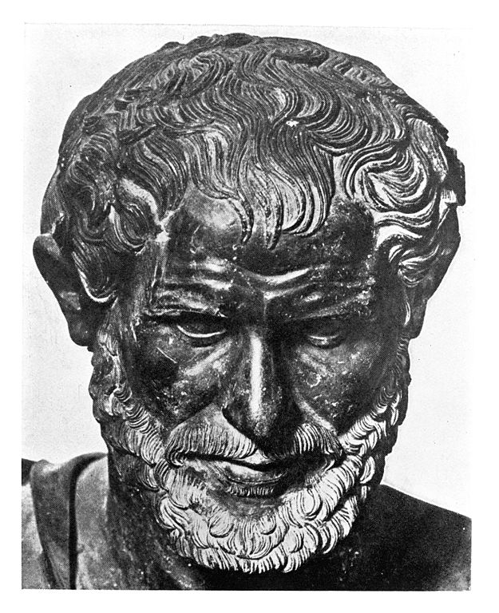
  

---

## Le Bitcoin facilite les activités illégales

- 0.2 à 1 % de transactions concernant des activités illégales (blanchiment/financement du terrorisme/traffic) contre 2 à 4% pour les fiats
- Tracabilité ! Le Bitcoin est pseudonyme. Tout est tracé sur la blockchain
- Obligation pour les échangeurs de faire passer un KYC aux clients
- Exemple de Silk Road 
- Exemple du hack de MtGox

https://www.forbes.com/sites/stevenehrlich/2021/04/13/janet-yellen-bitcoin-and-crypto-fearmongers-get-pushback-from-former-cia-director/

---

## Le Bitcoin pollue (1)
<!-- .slide: class="big-slide" -->
### Consommation énergétique et émissions en eq CO2

  

    <iframe data-src="https://app.everviz.com/embed/ywoqita/" width=100% height=500px></iframe>
    <ul>
      <li>Grèce : 57 MT CO2</li>
      <li>0.2% à 0.25% des émissions totales</li>
      <li>selon les rapports et les dates de 40 à 70% d'énergie renouvelable utilisée </li>
    <ul>
  

  

    <iframe data-src="https://ars.els-cdn.com/content/image/1-s2.0-S2542435122000861-gr2.jpg" width=100% height=500px></iframe>
  

---

## Le Bitcoin pollue (2)
<!-- .slide: class="big-slide" -->
### Rapport Digiconomist

<iframe data-src="https://digiconomist.net/bitcoin-energy-consumption" width=100% height=100%></iframe>

---
## Le Bitcoin pollue (3)
<!-- .slide: class="big-slide" -->

### Hashrate et consommation

<iframe data-src="https://api.blockchain.info/charts/preview/hash-rate.png?timespan=all&h=810&w=1440&daysAverageString=7D" width=1000px height=500px></iframe>

- Les émissions en CO2 sont proportionnelles au hashrate du réseau, i.e à son nombre de machine
- Les émissions en CO2 ne sont pas directement proportionnelles à l'utilisation ponctuelle du réseau
- L'augmentation du hashrate n'augmente pas les performances du réseau
- <em>Théoriquement</em>, la sécurité augmente avec le hashrate car l'attaque des 51% devient plus difficile

---
## Le Bitcoin pollue (4)
<!-- .slide: class="big-slide" -->
### Debunkage des fake news ou des malhonnêtetées intellectuelles

- Le Bitcoin, <b>c'est une révolution écologique</b> (utilisation de sources d'énergie renouvelables non utilisées avant, récupération de gachis électrique) : problème d'ordre de grandeur
- Le Bitcoin est une <b>énergie verte</b> : pour débunker ça, faut débunker la finance verte donc c'est long ...
- <b>Les banques aussi polluent</b> et même beaucoup plus : on compare des choux et des carottes, voir plus tard
- <b>Une transaction consomme énormément</b> : instantanément, le réseau consomme autant quelque soit la quantité de transactions
- <b>Tout le monde peut miner</b> : le minage est fait avec du matériel spécialisé professionnel, les ASICS, obscolescents très rapidement
- Le Bitcoin <b>consomme autant que le Danemark</b> : ne permet pas de se rendre compte de l'échelle et induit un biais
- Le Bitcoin <b>consomme moins que les appareils en veille et que les décorations de Noël</b> : idem

---
## Le Bitcoin pollue (5)
<!-- .slide: class="big-slide" -->

### Bitcoin vs VISA

  

    <h4></h4>
    <ul>
      <li>7 TPS</li>
      <li>1 à 2h pour la confirmation</li>
    <ul>
  

  

   <h4></h4>
    <ul>
      <li>~1400 TPS, max 25 000 TPS</li>
      <li>~10 secondes pour la confirmation</li>
      <li>1 à 2 millions de fois moins consommateur en énergie / émetteur de CO2 que Bitcoin</li>
    <ul>
  

---
## Proof of Work et énergie (6)
### Pourquoi la comparaison Bitcoin - VISA est une fraude ?
On compare des choux et des carottes. VISA est un réseau mais contrairement à Bitcoin a besoin aussi de :
<ul>
  <li>Banques 🏦</li>
  <li>Multiples processeurs de paiements intermédiaires (Paypal, ApplePay, terminaux physiques) 💳</li>
</ul>

Bitcoin est un réseau et <b>une monnaie</b>. Il faut donc ajouter

<ul>
  <li>ATM 🏧</li>
  <li>Monnaie physique 💵</li>
</ul>

Pas de data sur la consommation de tout ça, mais un calcul d'ordre de grandeur donne dans les 100 à 200 TWh (sans tenir compte des investissements).

Cette comparaison est également biaisée car le système bancaire apporte des choses que le Bitcoin n'apporte pas.

---

## Le Bitcoin est l'aboutissement d'un système ultracapitaliste

### Le Bitcoin reproduit les mécanismes du système financier actuel (et ses dérives)

<blockquote class="twitter-tweet">
I am often asked if I will “return to cryptocurrency” or begin regularly sharing my thoughts on the topic again. My answer is a wholehearted “no”, but to avoid repeating myself I figure it might be worthwhile briefly explaining why here…
&mdash; Jackson Palmer (@ummjackson) <a href="https://twitter.com/ummjackson/status/1415353984617914370?ref_src=twsrc%5Etfw">July 14, 2021</a></blockquote>
---

## Limitations du Bitcoin

- Pas ou peu <b>scalable</b> (nombre fixe de blocs par minute et taille limitée d'un bloc)
- <b>Frais fixes</b>, qui augmentent avec le nombre de transactions en cours (congestion)
- <b>Pseudonymité</b> et transparence
- <b>Vitesse</b> de confirmation des transactions (entre 1h et 2h)
- Très grande difficulté à faire <b>évoluer le protocole</b> (maximalisme, décentralisation, ...)

---

# 3. Les Altcoins

---

## Des altcoins à foison

Résoudre les limitations de Bitcoin et/ou les critiques

- <b>Hard fork de Bitcoin</b> : Bitcoin Cash, Bitcoin SV
- <b>D'autres méthodes consensus</b> : Proof of Stake, Proof of Capacity, Proof of Hold, Proof of Authority ...
- <b>Augmentation de la vitesse</b> : Stellar, Ripple, les layers 1 alternatifs
- <b>Augmentation du TPS au détriment de la décentralisation</b> : Binance Smart Chain, Solana
- <b>Privacy coin</b> : Monero
- <b>Blockchains programmables </b>: Ethereum, Polkadot, Cosmos, Avalanche, ...

Chaque altcoin entend établir un ou des cas d'utilisations spécifiques.

---
## CAP théorème

<!-- .slide: class="big-slide" -->

  
<!-- .element: class="fragment" -->
    
  

  

    
  

  
<!-- .element: class="fragment" -->
    
  

  

  

  
<!-- .element: class="fragment" -->
    
    
  

  

  

<ul>
  <li><b>Consistency</b> : tous les nœuds du système voient exactement les mêmes données au même moment</li>
  <li><b>Availability</b> : garantie que toutes les requêtes reçoivent une réponse</li>
  <li><b>Partition Tolerance</b> : dans le cas d'une panne réseau, choisir entre C et A</li>
</ul>

---
## Le trilemne blockchain

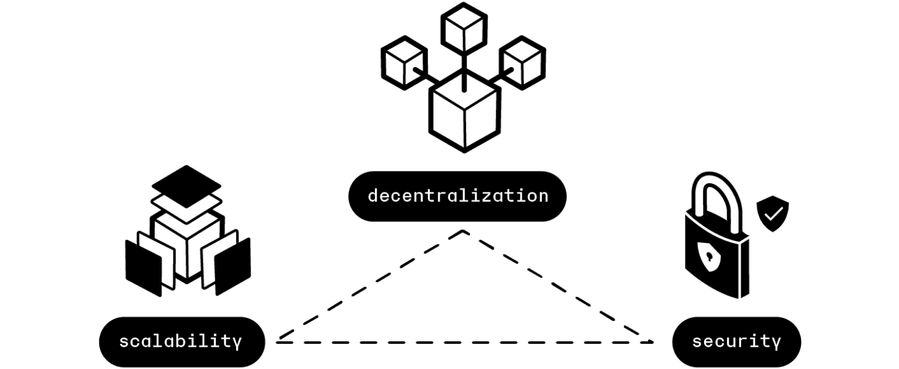

---

## Ethereum
<!-- .slide: class="big-slide" -->

  

    <ul>
      <li>Créé en 2014 par Vitalik Buterin</li>
      <li>Nouveau protocole utilisant un langage Turing Complet (contrairement à Bitcoin)</li>
      <li>15 TPS</li>
      <li>1 bloc toutes les 15 secondes</li>
      <li>Frais payé en Gwei (1 Gwei = 10-6) appelé le gas</li>
      <li>Ethereum c'est un protocole et un réseau, la cryptomonnaie permettant de payer le gas s'appelle l'ether</li>
      <li>Contrats intelligents, création de tokens fongibles (ERC-20) ou non fongibles (ERC-721)</li>
      <li>Fonctionne avec le Proof of Work, miné principalement par des GPU, 2 ETH par bloc de récompense</li>
    </ul>
  

  

    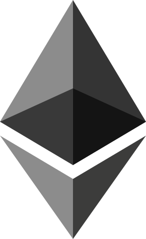
  

---

## Ethereum 2.0

  

    <ul>
      <li>Transition vers le Proof of Stake et utilisation de sharding afin d'augmenter drastiquement le TPS</li>
      <li><b>Phase 0 (12/2020)</b> : la Beacon Chain, chaîne centrale d'exécution de code et de Proof of Stake</li>
      <li><b>Phase 1 (Q2 2022)</b> : le merge, fusionne la Beacon Chain avec le réseau Ethereum 1.0, passage en Proof of Stake</li>
      <li><b>Phase 2 (2023)   </b> : introduction du sharding, Ethereum 1.0 devenant une des 64 shards</li>
    </ul>
  

  

    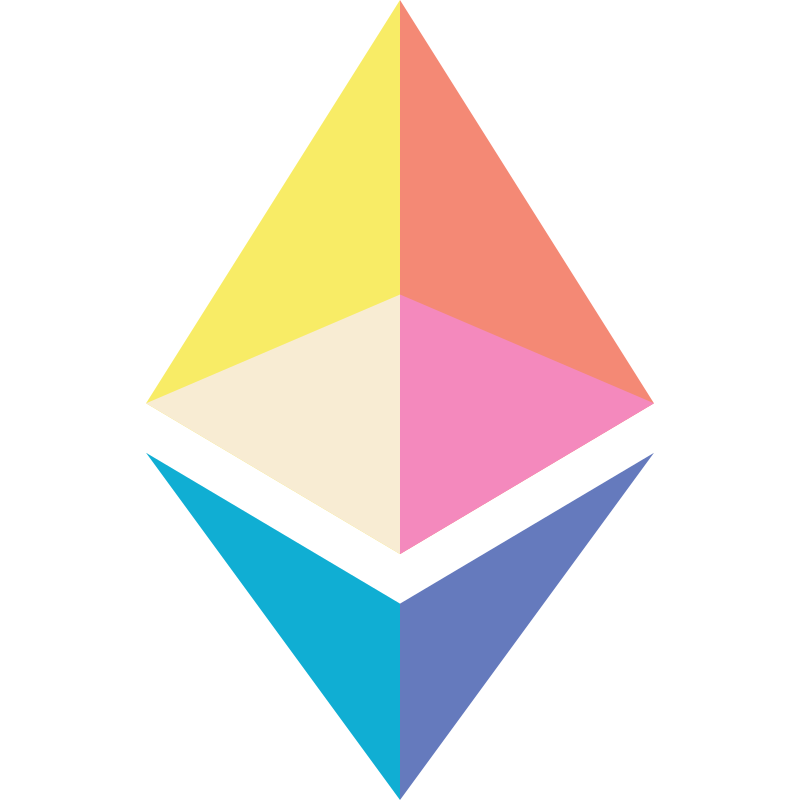
  

---

## Une nouvelle méthode de consensus : le Proof of Stake
<!-- .slide: class="big-slide" -->

- Les validateurs
  - 32 ETH pour devenir validateur
  - Les validateurs peuvent subir des pénalités en cas de mauvais comportements
  - Les validateurs récupèrent les frais en gas dépensés par les utilisiteurs du réseau
- La Beacon Chain
  - Maintient la sychronisation des shards
  - Enregistre les stake des validateurs
  - Choisit le validateur pour chaque bloc
  - Un comité de 128 valideurs atteste le bloc
  - Ce comité est reformé alétoirement tous les 32 blocs
- Peu vulnérable à l'attaque à 51% car nécessite de posséder 51% des ETH stakés
---

## Le staking
<!-- .slide: class="big-slide" -->

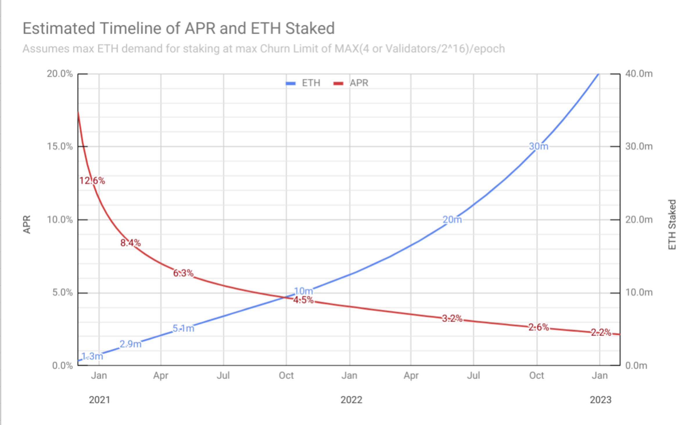

---

## Les Smart Contracts
<!-- .slide: class="big-slide" -->

- Code informatique (Solidity) exécuté par les validateurs, souvent mis à disposition via un frontend
  - <b>Exemple</b> : le mécanisme de staking pour Eth2.0 est effectué via un contrat intelligent
- Permet la développement d'applications décentralisées complexes
  - Supprime les intermédiaires de confiance
  - Contrat d'assurance
  - Instruments financiers : options, obligations, actions, emprunt, ...
  - Gouvernance et vote (⚠️ pas avec toutes les conditions d'un vote tel que l'on fait pour des élections politiques)

---

# De nouveaux usages

---

## Coins vs Tokens

- Ethereum  permet de créer des tokens qui vont pouvoir être échangé sur la blockchain (ERC-20)
  - <b>Exemple</b> : le BAT, propulsé par Brave, l'USDC, stablecoin émis par Circle, adossé au dollar
- Un coin est un token natif de blockchain (le token qui sert à payer les frais et à sécuriser la blockchain)
- Certaines cryptomonnaies sont des coins sur une blockchain et des tokens sur d'autres
  - <b>Exemple</b> : le WBTC, représentation du BTC sur Ethereum est un token
- Passage d'une blockchain à une autre grâce à des bridges

---

## Les oracles

<b>Problème</b> : seule les données disponibles sur la blockchain sont disponibles dans les smart contracts

- Création d'un réseau d'oracle qui fait le lien entre le <em>onchain</em> et le <em>offchain</em>
- Permet au smart contract de connaître :
  - La température actuelle
  - Le prix de l'or
  - Le nombre d'abonné d'une chaine YouTube
- Les opérateurs sont payés en token LINK lorsqu'ils donnent accès à des data offchain
- Pour devenir opérateur, il faut déposer du LINK en garantie

---

## La Defi (Decentralized Finance)
<!-- .slide: class="big-slide" -->

Permet d'utiliser les outils de la finance de manière décentralisée :
- Emprunt
- Assurance
- Actifs variés : actions, matière premières tokenisés, forex
- Outils d'investissement : options, vente à découvert, levier

---

## Les NFT

  

    <ul>
      <li>NFT : Token non fongible</li>
      <li>Suis le standard ERC-721 sur Ethereum</li>
      <li>Très très spéculatif</li>
      <li>Très fortement utilisé pour blanchir de l'argent</li>
      <li>Confusion entre la propriété intellectuelle et la possession d'un NFT</li>
      <li>Un NFT est une signature d'un pointeur (souvent une URL), en aucun cas une œuvre en elle-même</li>
      <li>Pointe vers un fichier très souvent <b>stocké offchain</b> (image, vidéo, musique, texte, ...)</li>
      <li><a href="https://opensea.io">Opensea</a></li>
    </ul>
  

  

    
  

---

## Les PlayToEarn
<!-- .slide: class="big-slide" -->

- Implémentation d'un marché ouvert dans les jeux
- Nécessite parfois (pas toujours) un investissement de départ
- Les joueurs sont payés en tokens émis par le jeu pour leurs actions ingame
- Les tokens émis servent de boost ou d'items dans le jeu
- Possibilité de revendre ses items quand l'on part du jeu
- Sans jeu, les items ne valent rien

C'est une simple transposition du compte des joueurs dans une base de donnée centralisée à un wallet décentralisé

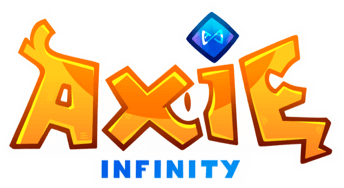

---

## Les Stablecoins
<!-- .slide: class="big-slide" -->

Token adossé à une monnaie fiat ou à un actif considéré comme stable (l'or par exemple)
<ul>
  <li>Collatéralisation</li>
  <li>Garantir la stabilité</li>
<ul>
 

  

    Collatéralisation par des fiat, stablecoin centralisé
    

      
      
      
    

    

      
      
    

  

  

    Collatéralisation par des cryptomonnaies, stablecoin décentralisé
    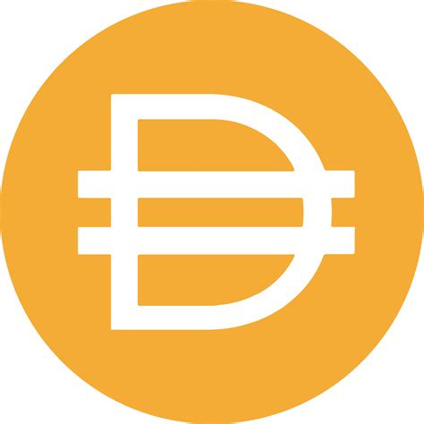
  

  

    Pas de collatéralisation, burn de 1$ de token pour créer un 1 UST, stablecoin algorithmique
    
  

---

## Les limites d'Ethereum

- Expérience utilisateur complexe pour les débutants
- Un système <b>peu scalable</b> : seulement 15 TPS
- Des <b>transactions chères</b> : de 10 à 20$ (voir plus en cas de congestion) pour envoyer des ether ou des ERC-20
- Des smart contrats très très chers (parfois plusieurs centaines de dollars en cas de congestion)
- Une <b>décentralisation imparfaite</b>
  - Nœuds très souvent hébergés sur le cloud public (~60% dont 25% sur AWS)
  - Interaction avec les smart contract passent très souvent par des API centralisées comme Infura ou Alchemy

---

## Les layers 2

Permet de résoudre les problèmes de la scalabilité
 

  

    <h3>Rollups</h3>
    Fusionne des batchs de transactions en une seule transaction sur la chaine principale
    

      

        
      

      

        
      

    

  

  

    <h3>Sidechains</h3>
    Entière blockchain détachée de la chaine principale
    
  

  

    <h3>Plasma</h3>
    C'est compliqué 😓
  

  

    <h3>Channel</h3>
    Permet d'échanger des représentations d'un coin détenu sur une blockchain
    Pas de smart contract
    
  

---

## L'apparition de nouvelles blockchains d'infrastructure
<!-- .slide: class="big-slide" -->

  

    <h3>Polkadot</h3>
    
    <ul>
      <li>Inspiré de Ethereum</li>
      <li>Interopérabilité, parachains, PoS</li>
    </ul>
  

  

    <h3>Avalanche</h3>
    
    <ul>
      <li>X-Chain, C-Chain, P-Chain</li>
      <li>Snowflake consensus</li>
    </ul>
  

  

    <h3>Binance Smart Chain</h3>
    
      <ul>
      <li>Propulsé par Binance</li>
      <li>Fork de Ethereum centralisé</li>
    </ul>
  

 

  

    <h3>Polygon</h3>
    
    <ul>
      <li>Side Chain d'Ethereum</li>
      <li>PoS, relativement décentralisé</li>
    </ul>
  

  

    <h3>Solana</h3>
    
    <ul>
      <li>Propulsé par FTX, centralisé</li>
      <li>Techologie entièrement différente de Ethereum</li>
    </ul>
  

  

    <h3>Elrond</h3>
    
    <ul>
      <li>Le meilleur de BTC et de ETH</li>
      <li>Techologie entièrement différente de Ethereum (WASM)</li>
    </ul>
  

---

# 4. Investissements ?

---

## Les échangeurs centralisés (CEX)
<!-- .slide: class="big-slide" -->

  

    <ul>
      <li>Une plateforme gère les échanges de manière centralisée : pas de transactions sur la blockchain.</li>
      <li>Frais payées à la plateforme</li>
      <li>Carnet d'ordres : on associe un vendeur et un acheteur</li>
      <li><b>MAKER</b> : mettre des ordres d'achat ou de vente dans le carnet d'ordre</li>
      <li><b>TAKER</b> : acheter ou vendre au marché dans les ordres</li>
    </ul>
    On ne possède pas les clés de ses cryptomonnaies
    

      

        
      

      

        
      

      

        
      

      

        
      

      

        
      

    

  

  

    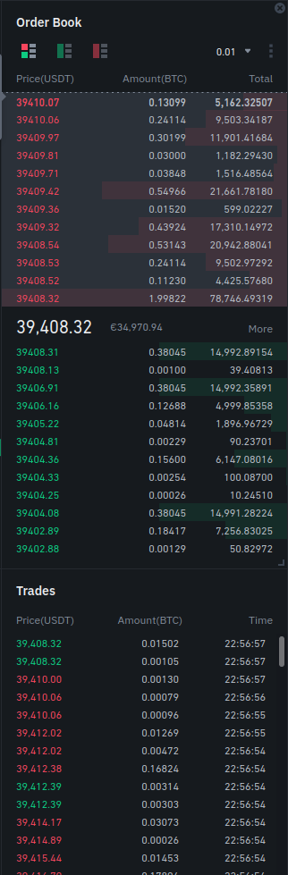
  

---

## Les échangeurs décentralisés (DEX)
<!-- .slide: class="big-slide" -->

- Utilise des pools de liquidité permettant de faire des échanges
- Les fournisseurs de liquidité ajoutent deux cryptomonnaies en quantité (en $) égale
- Les traders peuvent venir faire leurs échanges dans cette pool en payant des frais aux fournisseurs de liquidité
- Géré par un smart contract

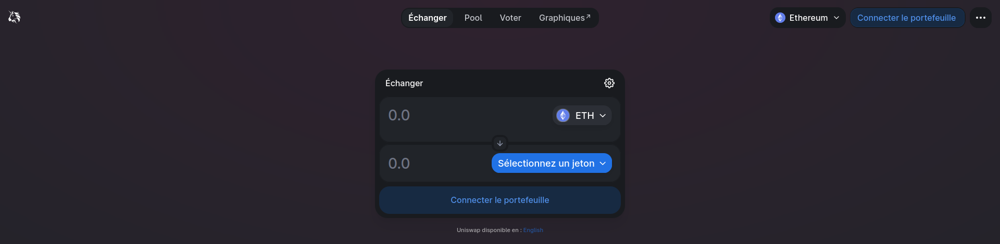

---

## Cyclicité du Bitcoin et des cryptomonnaies
<!-- .slide: class="big-slide" -->

---

## Stratégies d'investissements

- DCA (<em>Dollar Cost Average</em>) : investir un peu à intervalle de temps régulier (par exemple semaine)
- Acheter après des grosses baisses de 50% ou plus
- <b>NE JAMAIS</b> acheter quand tout le monde en parle et que la courbe est parabolique
- Se former à l'analyse technique basique (RSI, MACD, retracement de Fibonacci, trendlines, vagues d'Elliot, orderflow, ...)
- Rester les pieds sur terre, prendre du recul quand on entend que tel ou tel crypto est une révolution

---

## Random

<!-- .slide: class="big-slide" -->

- Utilisation des NFT pour authentification
- Stratégies avancées en Defi, rendement sur des stablecoins
- Programmation de Smart Contracts en Solidity
- Ethereum Virtual Machine

---

# Questions ?

---

## Sources, références, pour aller plus loin

- https://github.com/thibaultserti/slides-cryptocurrency
- https://www.coursera.org/learn/cryptocurrency
- https://github.com/bitcoinbook/bitcoinbook
- https://github.com/ethereumbook/ethereumbook
- https://coinmarketcap.com
- https://bitcoin.org
- https://ethereum.org
- [Le mystère Satoshi](https://www.youtube.com/watch?v=0ETcLj5jBy4)
- [Whiteboard Crypto](https://www.youtube.com/channel/UCsYYksPHiGqXHPoHI-fm5sg)

---

## Mes referals 🤑

<!-- .slide: class="big-slide" -->

- **Swissborg** : https://join.swissborg.com/r/thibauOYKV
- **Nexo** : https://nexo.io/ref/hxkgumrvxz?src=android-link
- **Crypto.com App** : https://crypto.com/app/7p7jkbp5sj
- **Crypto.com Exchange** : https://crypto.com/exch/7p7jkbp5sj
- **Binance** : https://accounts.binance.com/fr/register?ref=81135148
- **FTX** : https://ftx.com/#a=12460172
- **Maiar** : https://get.maiar.com/referral/tp1qokr73z

- **BTC** : bc1qyk62saxsgl5ng2mk54ue6ftgudkjyg0a0x3xrk
- **ETH** : 0xf39b36242bd9E3aa1269C40367369e012936342B
- **BNB** : bnb1w6hgq4tgde0my9nrasexqy2q02maqx9v3q2752
- **EGLD** : erd1xy53cvkp2vajqe6szs3p2xayltvxp6twu8c3rhreu5wczlv6hxwse99w25
