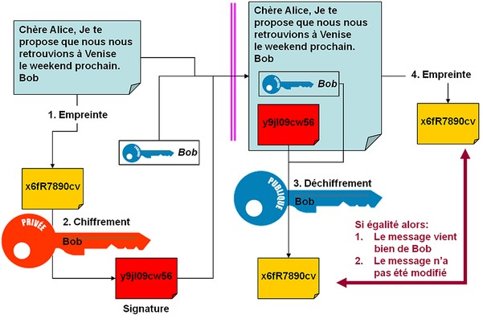

<link href="css/style.css" rel="stylesheet"/>

# Blockchain et cryptomonnaies

 
 
 

Thibault Ayanides

---

## Sommaire

1. Définitions
2. Rappels de cryptographie
3. La blockchain
4. La blockchain Bitcoin
5. Le Bitcoin
6. Les applications de la blockchain
7. Les altcoins
8. L'économie des cryptomonnaies
9. Les NFTs
10. Le Bitcoin soumis à la crise énergétique

---

## BLOCKCHAIN

- Technologie de transmission et de stockage et de stockage d'information
- Base de données distribuée ou non
- Registre d'enregistrement
- Incorpore des mécanismes de sécurisation et de protection contre la falsification fondées sur la cryptographie

<!-- .slide: data-background="./img/blockchain.png" data-background-opacity="0.2" -->

---

## Vous avez dit blocs ?

- Composées de plusieurs blocs
- Chaque bloc contient un certain nombre d'enregistrement (transactions, documents, ...)

<!-- .element: class="fragment" -->
---

# Mais d'abord un point de cryptographie !

---

## Les fonctions de hachage

On appelle <em>h</em>, fonction de hachage si elle répond aux caractéristiques suivantes :
<ul>
  <li> <em>h(m)</em> se calcule facilement</li> <!-- .element: class="fragment" -->
  <li> pour une valeur <em>d</em> donnée, il est très difficile de trouver <em>m</em> tel que <em>h(m)=d</em> </li> <!-- .element: class="fragment" -->
  <li> on ne peut modifier un message m sans changer son hash </li> <!-- .element: class="fragment" -->
  <li> étant donné <em>m1</em>, il est très difficile de trouver <em>m2</em> tel que <em>h(m1)= h(m2)</em></li> <!-- .element: class="fragment" -->
</ul>

  
<!-- .element: class="fragment" -->
    
  

  
<!-- .element: class="fragment" -->
    
Exemples :

    <ul>
      <li>MD5</li>
      <li>SHA-1</li>
      <li>SHA-2</li>
  

---

## Les signatures électroniques
<!-- .slide: class="big-slide" -->

---

## Caractéristiques d'une signature numérique
- Identification du propriétaire de la signature
- Garantie de la non altération du document entre la signature et la lecture
  - authentique
  - infalsifiable
  - non réutilisable
  - inaltérable
  - irrévocable

---
## Arbre de Merkle
<!-- .slide: class="big-slide" -->

---

## Intérêt des arbres de Merkle
<!-- .slide: class="big-slide" -->

Permet de vérifier un enregistrement sans tout télécharger.
Sans ça chaque utilisateur de la blockchain devrait la stocker en local !

---

## Anatomie d'un bloc
<!-- .slide: class="big-slide" -->

---
## Anatomie de la blockchain

---

## CRYPTOMONNAIES

- Cryptoactifs, cryptodevises, monnaies numériques, ... (nom sujet à débat)
- Émise de pair à pair sans passer par une banque centrale
- Souvent décentralisée
- Repose sur la cryptographie pour sécuriser les transactions

 
 

Plusieurs objectifs initiaux :

 
 

  

    
    se passer de tiers de confiance
  

  

    
    être rapide et fiable
  

  

    
    éviter l'hyperinflation
  

---

## Bitcoin

Une cryptomonnaie parmi beaucoup d'autres !

<ul>
  <li>Une cryptomonnaie</li><!-- .element: class="fragment" -->
  <li>Un protocole</li><!-- .element: class="fragment" -->
  <li>Une blockchain</li><!-- .element: class="fragment" -->
</ul>

---
## La naissance du Bitcoin

  

    <ul>
      <li> v1.0 sort en 2009 </li>
      <li> Créé par Satoshi Nakamoto </li>
      <li> Première cryptomonnaie </li>
      <li> Limitée à 21 millions de coin </li>
      <li> Minable par preuve de travail (PoW) </li>
    </ul>
  

  

    
  

---

## Une transaction Bitcoin
<!-- .slide: class="big-slide" -->

---

## Les wallets

<ul>
  <li>Une identité</li>
  <li>Une clé publique et une clé privée</li>
  <li>Logiciel permettant de gérer sa cryptomonnaie</li>
  <li>Hardware wallet vs Software wallet</li>
</ul>

 

Exemples:

  

    
  

  

    
  

  

    
  

  

    
  

  

    
  

  

    
  

## Hot wallet vs Cold Wallet

---

## Mécanismes de consensus

---

## Validation d'une transaction

---

# Mais comment fait-on pour créer des Bitcoins ?

---

## Le minage

---

## Avantages et limites du protocle Bitcoin

---

## Modèle centralisé vs modèle décentralisé

---

## Un hardware très spécialisé

---

## Random

---
# Questions ?
